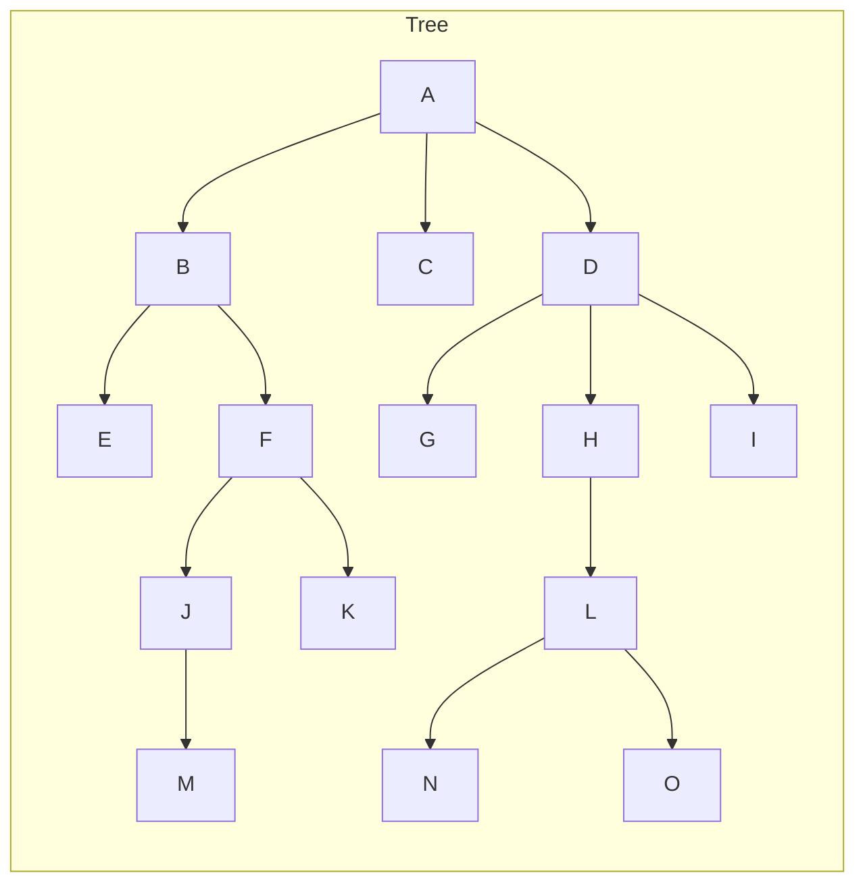
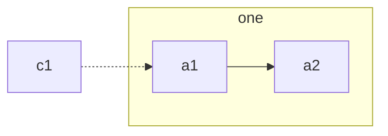
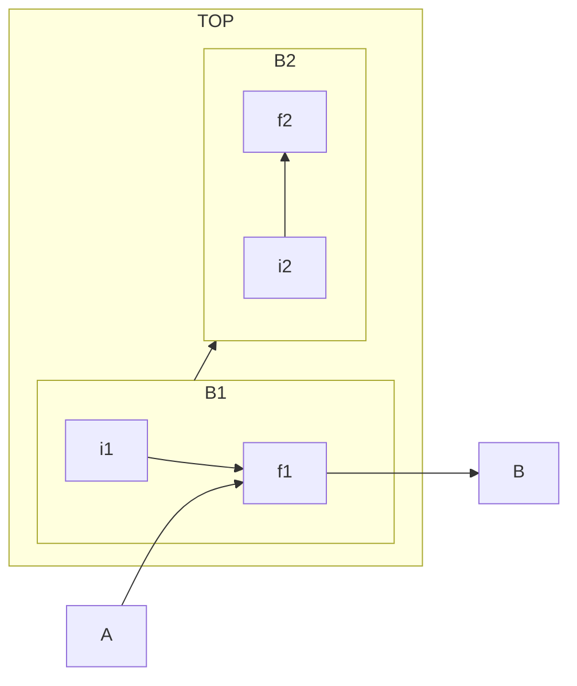

## Tree - Tree is the collection of nodes where one of the node is taken as root node and rest of the nodes are divided into disjoint subsets where each subset is a subtree.

1. Root
2. Parent
3. Child
4. Siblings
5. Descendents
6. Ancestors
7. Degree of a node
8. Internal/External nodes
9. Levels
10. Height
11. Forest
